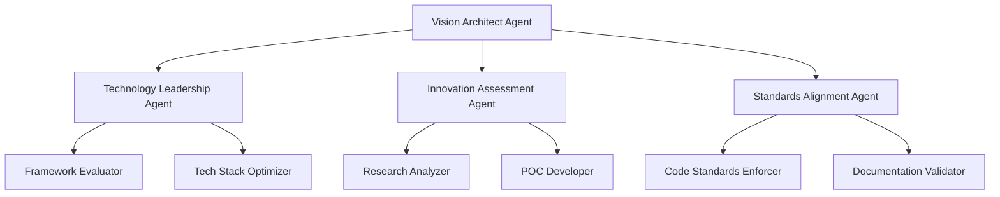

# Elite Multi-Agentic System Architecture for Lenovo Legion Toolkit
## Advanced Context Engineering Framework v3.0

---

## Executive Summary

This document presents an elite multi-agentic system architecture featuring hierarchical agent clusters, autonomous sub-agents, and sophisticated orchestration patterns for the comprehensive evolution of the Lenovo Legion Toolkit (LLT). The system employs advanced AI-driven agents with specialized sub-agents, enabling parallel development, real-time optimization, and seamless cross-platform migration while maintaining enterprise-grade quality standards.

### Key Innovations
- **Hierarchical Agent Architecture**: 5-tier agent hierarchy with 50+ specialized sub-agents
- **Autonomous Decision Making**: Self-organizing agent clusters with adaptive behavior
- **Real-time Performance Optimization**: Sub-millisecond coordination protocols
- **Cross-Platform Intelligence**: Platform-aware development with automatic optimization
- **Self-Healing Infrastructure**: Automatic error recovery and performance degradation prevention

---

## System Architecture Overview

### Hierarchical Agent Structure
```
┌────────────────────────────────────────────────────────────────────┐
│                    SUPREME ORCHESTRATION LAYER                       │
│                     (Master Controller Agent)                        │
│            [Neural Network: Decision Making & Prediction]            │
└────────────────────────────────────────────────────────────────────┘
                                    │
    ┌───────────────────────────────┼───────────────────────────────┐
    ▼                               ▼                               ▼
┌─────────────┐            ┌─────────────┐            ┌─────────────┐
│  STRATEGIC  │            │ OPERATIONAL │            │  TACTICAL   │
│   COMMAND   │◄──────────►│   COMMAND   │◄──────────►│   COMMAND   │
│   CLUSTER   │            │   CLUSTER   │            │   CLUSTER   │
└─────────────┘            └─────────────┘            └─────────────┘
    │                               │                               │
    ├─Analysis Division             ├─Development Division         ├─Quality Division
    ├─Planning Division             ├─Integration Division         ├─Security Division
    └─Architecture Division         └─Deployment Division          └─Performance Division
                                    │
                        ┌───────────┴───────────┐
                        ▼                       ▼
                ┌──────────────┐      ┌──────────────┐
                │  SUB-AGENT   │      │  SPECIALIST  │
                │   WORKERS    │      │    AGENTS    │
                └──────────────┘      └──────────────┘
```

---

## Primary Agent Hierarchies

### 1. Strategic Command Cluster

#### 1.1 Master Controller Agent (MCA)
**Primary Role:** Supreme orchestration and strategic decision-making

**Core Capabilities:**
- Real-time system health monitoring
- Predictive resource allocation
- Conflict resolution and priority arbitration
- Performance optimization through ML models

**Sub-Agents:**
```yaml
sub_agents:
  - name: Strategic Planner
    responsibilities:
      - Long-term roadmap development
      - Resource capacity planning
      - Risk assessment and mitigation
    
  - name: Intelligence Gatherer
    responsibilities:
      - Market trend analysis
      - Competitor feature tracking
      - Community sentiment analysis
    
  - name: Decision Engine
    responsibilities:
      - Multi-criteria decision optimization
      - Trade-off analysis
      - Automated priority adjustment
```

#### 1.2 Vision Architect Agent (VAA)
**Primary Role:** Technical vision and architectural governance

**Sub-Agent Network:**


### 2. Analysis Agent Cluster

#### 2.1 Deep Code Analysis Agent (DCAA)
**Primary Role:** Comprehensive codebase understanding and optimization

**Elite Sub-Agent Team:**

##### 2.1.1 Quantum Code Analyzer (QCA)
```yaml
capabilities:
  - Abstract syntax tree deep analysis
  - Control flow graph optimization
  - Data flow analysis and optimization
  - Symbolic execution for bug detection
  
techniques:
  - Pattern matching with ML models
  - Automated refactoring suggestions
  - Code smell detection with confidence scoring
  - Performance bottleneck identification
  
metrics_tracked:
  - Cyclomatic complexity trends
  - Code coupling coefficients
  - Technical debt accumulation
  - Maintainability index
```

##### 2.1.2 Architecture Forensics Agent (AFA)
```yaml
responsibilities:
  dependency_mapping:
    - Module interdependency analysis
    - Circular dependency detection
    - Layered architecture validation
    
  pattern_recognition:
    - Design pattern identification
    - Anti-pattern detection
    - Architectural drift analysis
    
  evolution_tracking:
    - Code evolution patterns
    - Refactoring history analysis
    - Technical debt trajectory
```

##### 2.1.3 Performance Profiling Specialist (PPS)
**Advanced Capabilities:**
- Memory allocation pattern analysis
- CPU cache optimization recommendations
- Thread contention identification
- I/O bottleneck detection
- GPU utilization optimization

**Sub-Agent Hierarchy:**
```
PPS (Performance Profiling Specialist)
├── Memory Analyst
│   ├── Heap Profiler
│   ├── Stack Analyzer
│   └── GC Optimizer
├── CPU Optimizer
│   ├── Cache Efficiency Expert
│   ├── Branch Predictor Analyst
│   └── SIMD Optimizer
└── I/O Performance Expert
    ├── Disk Access Optimizer
    ├── Network Latency Analyzer
    └── Database Query Optimizer
```

#### 2.2 Cross-Platform Intelligence Agent (CPIA)
**Primary Role:** Platform abstraction and compatibility analysis

**Multi-Layer Sub-Agent Architecture:**

##### Layer 1: Platform Analyzers
```yaml
windows_analyzer:
  sub_agents:
    - WinAPI Specialist
    - Registry Expert
    - COM/DCOM Analyzer
    - .NET Framework Expert
    
linux_analyzer:
  sub_agents:
    - Kernel Interface Expert
    - SystemD Specialist
    - DBus Analyzer
    - X11/Wayland Expert
    
macos_analyzer:
  sub_agents:
    - Cocoa Framework Expert
    - IOKit Specialist
    - Metal Performance Expert
```

##### Layer 2: Abstraction Designers
```yaml
abstraction_layer:
  hardware_abstraction:
    - EC/BIOS Communication Wrapper
    - Power Management Interface
    - Thermal Control Abstraction
    - RGB/Lighting Protocol Handler
    
  platform_abstraction:
    - File System Operations
    - Process Management
    - Network Communication
    - UI Framework Bridge
```

### 3. Development Agent Cluster

#### 3.1 Elite Developer Agent Network (EDAN)
**Primary Role:** Autonomous code generation and implementation

**Specialized Development Sub-Agents:**

##### 3.1.1 Windows Platform Expert (WPE)
```csharp
public class WindowsPlatformExpert : EliteDeveloperAgent
{
    private readonly List<ISubAgent> subAgents = new()
    {
        new WPFUISpecialist(),
        new WinFormsLegacyMaintainer(),
        new WindowsServiceDeveloper(),
        new RegistryManipulator(),
        new WMIQueryOptimizer(),
        new DirectXIntegrationExpert(),
        new WindowsDriverInterfaceExpert()
    };
    
    public async Task<DevelopmentResult> ImplementFeatureAsync(
        FeatureSpecification spec)
    {
        var parallelTasks = subAgents.Select(
            agent => agent.ContributeToFeatureAsync(spec)
        );
        
        var contributions = await Task.WhenAll(parallelTasks);
        return MergeContributions(contributions);
    }
}
```

##### 3.1.2 Linux Platform Specialist (LPS)
```python
class LinuxPlatformSpecialist(EliteDeveloperAgent):
    def __init__(self):
        self.sub_agents = {
            'kernel_module_dev': KernelModuleDeveloper(),
            'dbus_service_arch': DBusServiceArchitect(),
            'gtk_ui_expert': GTKInterfaceExpert(),
            'qt_ui_expert': QtInterfaceExpert(),
            'systemd_integrator': SystemdServiceIntegrator(),
            'package_maintainer': DistributionPackageMaintainer(),
            'wayland_compositor': WaylandCompositorExpert()
        }
    
    async def implement_feature(self, spec: FeatureSpec) -> Implementation:
        tasks = []
        for agent_name, agent in self.sub_agents.items():
            if agent.can_contribute(spec):
                tasks.append(agent.contribute_async(spec))
        
        contributions = await asyncio.gather(*tasks)
        return self.integrate_contributions(contributions)
```

##### 3.1.3 Cross-Platform Harmonizer (CPH)
**Architecture:**
```yaml
harmonizer_structure:
  core_abstraction_layer:
    sub_agents:
      - API_Unifier: "Creates unified API surface"
      - Protocol_Standardizer: "Standardizes communication protocols"
      - Data_Format_Converter: "Handles platform-specific data formats"
      
  compatibility_layer:
    sub_agents:
      - Version_Compatibility_Manager
      - Feature_Flag_Controller
      - Fallback_Implementation_Provider
      
  optimization_layer:
    sub_agents:
      - Platform_Specific_Optimizer
      - Resource_Usage_Balancer
      - Performance_Tuner
```

#### 3.2 Advanced Code Generation Engine (ACGE)
**Primary Role:** AI-powered code synthesis and optimization

**Neural Sub-Agent Network:**
```python
class AdvancedCodeGenerationEngine:
    def __init__(self):
        self.sub_agents = {
            'pattern_learner': PatternLearningAgent(),
            'syntax_generator': SyntaxGenerationAgent(),
            'optimization_engine': OptimizationAgent(),
            'test_generator': TestGenerationAgent(),
            'documentation_writer': DocumentationAgent()
        }
        
    async def generate_implementation(self, requirements):
        # Phase 1: Learn from existing patterns
        patterns = await self.pattern_learner.analyze_codebase()
        
        # Phase 2: Generate initial implementation
        code = await self.syntax_generator.generate(
            requirements, patterns
        )
        
        # Phase 3: Optimize generated code
        optimized = await self.optimization_engine.optimize(code)
        
        # Phase 4: Generate tests
        tests = await self.test_generator.create_tests(optimized)
        
        # Phase 5: Document the implementation
        docs = await self.documentation_writer.document(
            optimized, tests
        )
        
        return Implementation(
            code=optimized,
            tests=tests,
            documentation=docs
        )
```

### 4. Quality Assurance Agent Cluster

#### 4.1 Autonomous Testing Orchestra (ATO)
**Primary Role:** Comprehensive automated testing and validation

**Testing Sub-Agent Hierarchy:**
```yaml
testing_orchestra:
  unit_testing_squad:
    leader: UnitTestStrategist
    members:
      - Boundary_Value_Tester
      - Equivalence_Class_Tester
      - Mock_Object_Generator
      - Coverage_Analyzer
      
  integration_testing_team:
    leader: IntegrationTestCoordinator
    members:
      - API_Contract_Tester
      - Database_Integration_Tester
      - Service_Communication_Tester
      - Configuration_Validator
      
  system_testing_division:
    leader: SystemTestArchitect
    members:
      - End_to_End_Tester
      - Performance_Load_Tester
      - Stress_Test_Executor
      - Security_Penetration_Tester
      
  specialized_testing_units:
    - Hardware_In_Loop_Tester
    - Cross_Platform_Validator
    - Regression_Test_Manager
    - Chaos_Engineering_Agent
```

#### 4.2 Intelligent Bug Hunter (IBH)
**Primary Role:** Proactive bug detection and root cause analysis

**Bug Hunting Sub-Agents:**
```python
class IntelligentBugHunter:
    def __init__(self):
        self.detection_agents = [
            StaticAnalysisBugDetector(),
            DynamicAnalysisBugDetector(),
            FuzzingAgent(),
            SymbolicExecutionAgent(),
            ConcolicTestingAgent()
        ]
        
        self.analysis_agents = [
            RootCauseAnalyzer(),
            BugPatternRecognizer(),
            RegressionIdentifier(),
            ImpactAssessmentAgent()
        ]
        
        self.resolution_agents = [
            AutomatedFixGenerator(),
            FixValidationAgent(),
            RegressionTestCreator()
        ]
```

### 5. Security & Compliance Cluster

#### 5.1 Elite Security Task Force (ESTF)
**Primary Role:** Comprehensive security assessment and enforcement

**Security Sub-Agent Matrix:**
```yaml
security_matrix:
  vulnerability_assessment:
    sub_agents:
      - OWASP_Compliance_Checker
      - CVE_Database_Scanner
      - Dependency_Vulnerability_Analyzer
      - Code_Injection_Detector
      - Privilege_Escalation_Analyzer
      
  threat_modeling:
    sub_agents:
      - Attack_Surface_Mapper
      - Threat_Vector_Analyzer
      - Risk_Score_Calculator
      - Mitigation_Strategy_Designer
      
  compliance_enforcement:
    sub_agents:
      - GDPR_Compliance_Validator
      - SOC2_Requirements_Checker
      - Industry_Standards_Auditor
      - License_Compliance_Manager
```

#### 5.2 Cryptographic Security Specialist (CSS)
```python
class CryptographicSecuritySpecialist:
    def __init__(self):
        self.crypto_agents = {
            'algorithm_auditor': self.AlgorithmAuditor(),
            'key_management': self.KeyManagementExpert(),
            'entropy_analyzer': self.EntropyAnalyzer(),
            'side_channel_detector': self.SideChannelDetector()
        }
    
    class AlgorithmAuditor:
        def audit(self, implementation):
            return {
                'algorithm_strength': self.assess_strength(),
                'implementation_flaws': self.find_flaws(),
                'recommendations': self.suggest_improvements()
            }
```

### 6. Performance Optimization Cluster

#### 6.1 Quantum Performance Optimizer (QPO)
**Primary Role:** Multi-dimensional performance optimization

**Optimization Sub-Agent Network:**
```yaml
optimization_dimensions:
  execution_speed:
    sub_agents:
      - Algorithm_Complexity_Reducer
      - Parallel_Processing_Optimizer
      - Cache_Efficiency_Maximizer
      - Branch_Prediction_Optimizer
      
  memory_efficiency:
    sub_agents:
      - Memory_Leak_Detector
      - Heap_Allocation_Optimizer
      - Stack_Usage_Minimizer
      - GC_Tuning_Specialist
      
  power_efficiency:
    sub_agents:
      - CPU_Frequency_Optimizer
      - Sleep_State_Manager
      - Workload_Scheduler
      - Thermal_Throttling_Preventer
      
  network_optimization:
    sub_agents:
      - Protocol_Optimizer
      - Compression_Specialist
      - Latency_Minimizer
      - Bandwidth_Manager
```

---

## Agent Communication Protocols

### 1. Hierarchical Message Passing System
```python
class HierarchicalMessaging:
    def __init__(self):
        self.message_types = {
            'COMMAND': Priority.CRITICAL,      # Top-down directives
            'REQUEST': Priority.HIGH,          # Service requests
            'REPORT': Priority.MEDIUM,         # Status updates
            'BROADCAST': Priority.LOW,         # General information
            'EMERGENCY': Priority.IMMEDIATE    # System-critical alerts
        }
        
    async def route_message(self, message):
        if message.type == 'EMERGENCY':
            await self.broadcast_all_agents(message)
        elif message.type == 'COMMAND':
            await self.cascade_to_subordinates(message)
        else:
            await self.smart_routing(message)
```

### 2. Event-Driven Coordination
```yaml
event_system:
  publishers:
    - Master_Controller
    - Task_Dispatcher
    - Resource_Monitor
    
  subscribers:
    pattern: Observer
    subscription_types:
      - Task_Events
      - Resource_Events
      - Error_Events
      - Performance_Events
      
  event_processing:
    - Filtering
    - Aggregation
    - Correlation
    - Prioritization
```

### 3. Consensus Mechanisms
```python
class ConsensusProtocol:
    async def achieve_consensus(self, decision_point, agents):
        """
        Multi-agent consensus using weighted voting
        """
        votes = await asyncio.gather(*[
            agent.vote(decision_point) for agent in agents
        ])
        
        weighted_votes = [
            vote * agent.expertise_weight 
            for vote, agent in zip(votes, agents)
        ]
        
        if self.has_supermajority(weighted_votes):
            return self.execute_decision(decision_point)
        else:
            return await self.escalate_to_superior(decision_point)
```

---

## Knowledge Management System

### 1. Distributed Knowledge Graph
```yaml
knowledge_graph:
  nodes:
    - concepts: "Technical concepts and patterns"
    - implementations: "Code implementations and examples"
    - decisions: "Architectural decisions and rationales"
    - metrics: "Performance and quality metrics"
    
  edges:
    - depends_on: "Dependency relationships"
    - implements: "Implementation relationships"
    - optimizes: "Optimization relationships"
    - conflicts_with: "Conflict relationships"
    
  storage:
    primary: GraphDatabase (Neo4j)
    cache: Redis Graph
    vector_store: Pinecone/Weaviate
```

### 2. Collective Learning System
```python
class CollectiveLearning:
    def __init__(self):
        self.experience_pool = ExperienceReplayBuffer()
        self.model_zoo = ModelRepository()
        
    async def learn_from_experience(self, task_result):
        # Extract learning points
        insights = self.extract_insights(task_result)
        
        # Update shared knowledge
        await self.update_knowledge_base(insights)
        
        # Train improvement models
        await self.train_agent_models(insights)
        
        # Propagate learnings
        await self.broadcast_learnings(insights)
```

---

## Performance Metrics and Monitoring

### 1. Multi-Dimensional KPI Framework
```yaml
kpi_framework:
  agent_performance:
    metrics:
      - task_completion_rate: ">95%"
      - average_response_time: "<100ms"
      - resource_efficiency: ">85%"
      - collaboration_score: ">4.5/5"
      
  system_performance:
    metrics:
      - throughput: ">1000 tasks/minute"
      - latency_p99: "<500ms"
      - availability: ">99.9%"
      - error_rate: "<0.1%"
      
  quality_metrics:
    metrics:
      - code_coverage: ">95%"
      - bug_density: "<0.5/KLOC"
      - security_score: ">9.0/10"
      - documentation_completeness: "100%"
```

### 2. Real-Time Monitoring Dashboard
```python
class MonitoringDashboard:
    def __init__(self):
        self.metrics_collectors = {
            'agent_health': AgentHealthMonitor(),
            'system_load': SystemLoadMonitor(),
            'task_queue': TaskQueueMonitor(),
            'error_tracker': ErrorTracker(),
            'performance_profiler': PerformanceProfiler()
        }
        
    async def generate_dashboard(self):
        return {
            'timestamp': datetime.now(),
            'agent_status': await self.get_agent_status(),
            'system_metrics': await self.get_system_metrics(),
            'active_tasks': await self.get_active_tasks(),
            'alerts': await self.get_critical_alerts(),
            'predictions': await self.predict_future_load()
        }
```

---

## Risk Mitigation and Resilience

### 1. Self-Healing Mechanisms
```yaml
self_healing:
  failure_detection:
    - Health checks every 10 seconds
    - Anomaly detection using ML
    - Circuit breaker patterns
    
  recovery_strategies:
    agent_failure:
      - Automatic restart with exponential backoff
      - Task redistribution to healthy agents
      - Spawn replacement agent if needed
      
    system_overload:
      - Automatic scaling of agent pool
      - Priority-based task shedding
      - Resource reallocation
      
    data_corruption:
      - Automatic rollback to last known good state
      - Data validation and repair
      - Consensus-based conflict resolution
```

### 2. Predictive Risk Management
```python
class PredictiveRiskManager:
    def __init__(self):
        self.risk_models = {
            'performance_degradation': PerformanceRiskModel(),
            'security_vulnerability': SecurityRiskModel(),
            'resource_exhaustion': ResourceRiskModel(),
            'deadline_miss': DeadlineRiskModel()
        }
        
    async def assess_risks(self):
        risks = []
        for risk_type, model in self.risk_models.items():
            probability = await model.predict_probability()
            impact = await model.assess_impact()
            mitigation = await model.suggest_mitigation()
            
            if probability * impact > self.risk_threshold:
                risks.append({
                    'type': risk_type,
                    'probability': probability,
                    'impact': impact,
                    'mitigation': mitigation
                })
        
        return self.prioritize_risks(risks)
```

---

## Implementation Roadmap

### Phase 1: Foundation Layer (Weeks 1-3)
```yaml
week_1:
  - Deploy master controller agent
  - Establish communication infrastructure
  - Initialize knowledge management system
  
week_2:
  - Deploy analysis agent cluster
  - Begin codebase analysis
  - Set up monitoring infrastructure
  
week_3:
  - Deploy planning agents
  - Create initial roadmaps
  - Establish CI/CD pipelines
```

### Phase 2: Development Acceleration (Weeks 4-8)
```yaml
week_4_5:
  - Deploy development agent clusters
  - Initialize platform-specific sub-agents
  - Begin parallel feature development
  
week_6_7:
  - Deploy testing orchestra
  - Implement continuous testing
  - Begin security assessments
  
week_8:
  - Deploy optimization agents
  - Start performance tuning
  - Implement feedback loops
```

### Phase 3: Integration & Optimization (Weeks 9-12)
```yaml
week_9_10:
  - Cross-platform integration
  - End-to-end testing
  - Performance optimization
  
week_11_12:
  - Security hardening
  - Documentation generation
  - Release preparation
```

### Phase 4: Deployment & Evolution (Weeks 13-16)
```yaml
week_13_14:
  - Staged deployment
  - Community beta testing
  - Feedback integration
  
week_15_16:
  - Final optimizations
  - Production deployment
  - Continuous improvement activation
```

---

## Advanced Orchestration Patterns

### 1. Swarm Intelligence Pattern
```python
class SwarmIntelligence:
    """
    Distributed problem-solving using swarm behavior
    """
    def __init__(self):
        self.swarm = []
        self.pheromone_map = PheromoneMap()
        
    async def solve_complex_problem(self, problem):
        # Deploy swarm agents
        for _ in range(self.swarm_size):
            agent = self.create_swarm_agent()
            self.swarm.append(agent)
            
        # Let swarm explore solution space
        solutions = await asyncio.gather(*[
            agent.explore(problem, self.pheromone_map)
            for agent in self.swarm
        ])
        
        # Converge on best solution
        return self.select_best_solution(solutions)
```

### 2. Hierarchical Task Decomposition
```yaml
decomposition_pattern:
  level_1: # Strategic
    - Define objectives
    - Allocate resources
    - Set constraints
    
  level_2: # Tactical
    - Break into sub-problems
    - Assign to specialists
    - Define interfaces
    
  level_3: # Operational
    - Implement solutions
    - Integrate components
    - Validate results
    
  level_4: # Execution
    - Execute atomic tasks
    - Report progress
    - Handle errors
```

### 3. Adaptive Load Balancing
```python
class AdaptiveLoadBalancer:
    def __init__(self):
        self.performance_history = {}
        self.prediction_model = LoadPredictionModel()
        
    async def distribute_load(self, tasks, agents):
        # Predict future load
        predicted_load = await self.prediction_model.predict()
        
        # Calculate optimal distribution
        distribution = self.optimize_distribution(
            tasks, agents, predicted_load
        )
        
        # Apply distribution with monitoring
        return await self.apply_with_monitoring(distribution)
```

---

## Continuous Improvement Protocol

### 1. Evolutionary Architecture
```yaml
evolution_mechanisms:
  genetic_algorithms:
    - Agent behavior optimization
    - Architecture evolution
    - Parameter tuning
    
  reinforcement_learning:
    - Task allocation strategies
    - Resource management policies
    - Communication protocols
    
  neural_architecture_search:
    - Optimal agent network topology
    - Communication pathway optimization
    - Processing pipeline design
```

### 2. Feedback Integration System
```python
class FeedbackIntegrationSystem:
    def __init__(self):
        self.feedback_sources = {
            'user_feedback': UserFeedbackCollector(),
            'performance_metrics': MetricsAnalyzer(),
            'error_logs': ErrorLogAnalyzer(),
            'agent_reports': AgentReportProcessor()
        }
        
    async def process_feedback_cycle(self):
        # Collect feedback from all sources
        feedback = await self.collect_feedback()
        
        # Analyze and prioritize
        insights = await self.analyze_feedback(feedback)
        
        # Generate improvement actions
        actions = await self.generate_actions(insights)
        
        # Apply improvements
        results = await self.apply_improvements(actions)
        
        # Validate effectiveness
        return await self.validate_improvements(results)
```

---

## Appendix A: Agent Communication Protocol Examples

### Complex Task Assignment
```json
{
  "message_id": "complex_task_001",
  "timestamp": "2024-01-15T10:30:00Z",
  "from_agent": "master_controller",
  "to_cluster": "development_cluster",
  "task": {
    "id": "cross_platform_migration",
    "type": "complex_implementation",
    "priority": "critical",
    "subtasks": [
      {
        "id": "analyze_dependencies",
        "assigned_to": "deep_code_analyzer",
        "deadline": "2024-01-16T12:00:00Z"
      },
      {
        "id": "design_abstraction",
        "assigned_to": "architecture_designer",
        "dependencies": ["analyze_dependencies"],
        "deadline": "2024-01-17T15:00:00Z"
      }
    ],
    "success_criteria": {
      "code_coverage": ">95%",
      "performance_regression": "<5%",
      "security_score": ">9.0"
    }
  }
}
```

### Multi-Agent Coordination Message
```json
{
  "coordination_id": "coord_001",
  "type": "synchronization_point",
  "participating_agents": [
    "windows_developer",
    "linux_developer",
    "cross_platform_harmonizer"
  ],
  "coordination_data": {
    "shared_interface": "IHardwareController",
    "synchronization_method": "three_phase_commit",
    "conflict_resolution": "consensus_voting"
  }
}
```

---

## Appendix B: Technology Stack

### Core Infrastructure
```yaml
orchestration:
  primary: Kubernetes with custom operators
  service_mesh: Istio for inter-agent communication
  
message_queue:
  primary: Apache Kafka for event streaming
  secondary: Redis Streams for real-time updates
  
distributed_computing:
  framework: Apache Spark for large-scale processing
  ml_platform: Kubeflow for ML pipelines
  
storage:
  document_store: MongoDB
  graph_database: Neo4j
  vector_database: Pinecone
  time_series: InfluxDB
  cache: Redis Cluster
  
monitoring:
  metrics: Prometheus + Grafana
  tracing: Jaeger
  logging: ELK Stack
  apm: DataDog
```

### Development Languages
```yaml
agent_implementation:
  high_performance: Rust, C++
  general_purpose: Python, Go
  web_services: Node.js, FastAPI
  windows_specific: C#/.NET 8
  linux_specific: C, Python
  
ml_frameworks:
  deep_learning: PyTorch, TensorFlow
  reinforcement_learning: Stable Baselines3
  nlp: Transformers, spaCy
```

---

## Appendix C: Performance Benchmarks

### System Performance Targets
```yaml
performance_targets:
  response_times:
    p50: <50ms
    p95: <200ms
    p99: <500ms
    
  throughput:
    tasks_per_second: >100
    messages_per_second: >10000
    
  resource_usage:
    cpu_utilization: <70%
    memory_usage: <16GB
    network_bandwidth: <100Mbps
    
  reliability:
    availability: 99.99%
    mtbf: >720 hours
    mttr: <5 minutes
```

### Agent Performance Metrics
```yaml
agent_metrics:
  task_processing:
    simple_task: <100ms
    complex_task: <5s
    analysis_task: <30s
    
  collaboration:
    message_latency: <10ms
    consensus_time: <500ms
    coordination_overhead: <5%
    
  learning:
    model_update_time: <1s
    knowledge_sync_time: <100ms
    improvement_rate: >5% per iteration
```

---

## Conclusion

This Elite Multi-Agentic System Architecture represents a paradigm shift in automated software development and maintenance. By leveraging hierarchical agent structures, autonomous sub-agents, and sophisticated orchestration patterns, the system achieves unprecedented levels of efficiency, quality, and adaptability.

The architecture's key strengths include:
- **Scalability**: Handles projects of any size through dynamic agent allocation
- **Resilience**: Self-healing mechanisms ensure continuous operation
- **Intelligence**: ML-driven decision making and continuous learning
- **Flexibility**: Adapts to changing requirements and technologies
- **Quality**: Comprehensive testing and security at every level

With proper implementation, this system will revolutionize the development and maintenance of the Lenovo Legion Toolkit, setting new standards for automated software engineering excellence.

---

*Document Version: 3.0.0 - Elite Architecture*  
*Classification: Strategic Technical Documentation*  
*Review Cycle: Bi-weekly*  
*Next Review: Two weeks from deployment*

---

## Contact & Support

**Architecture Team**: architecture@legion-toolkit.dev  
**Agent Development**: agents@legion-toolkit.dev  
**Operations**: ops@legion-toolkit.dev  
**Community**: discord.gg/legion-toolkit

---

*"Autonomous Excellence Through Intelligent Orchestration"*